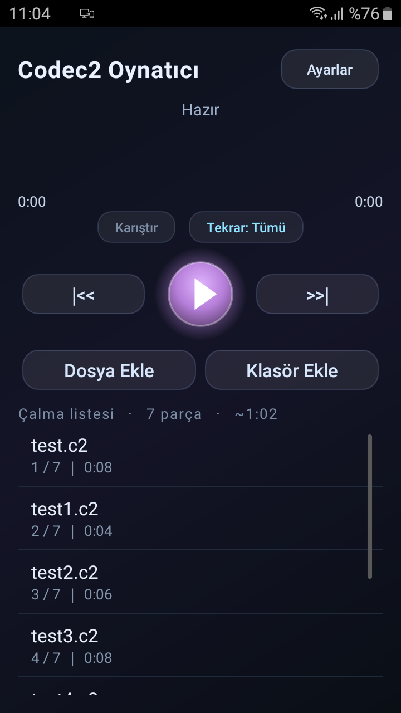
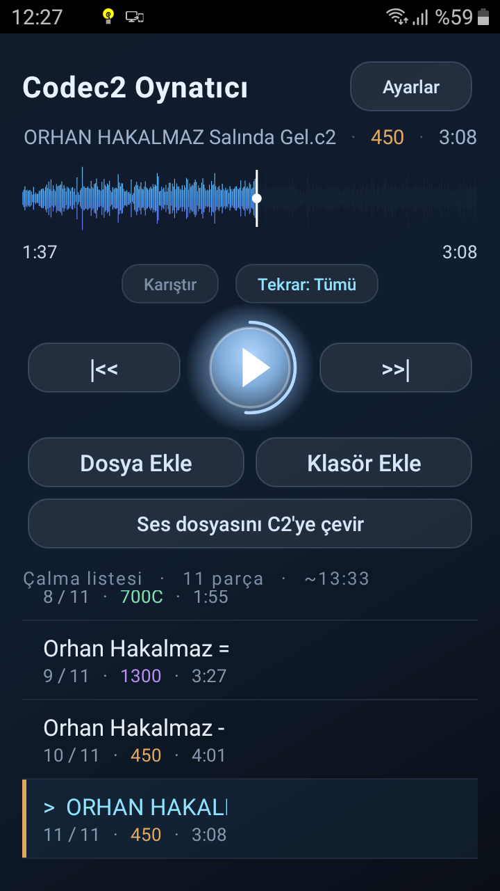
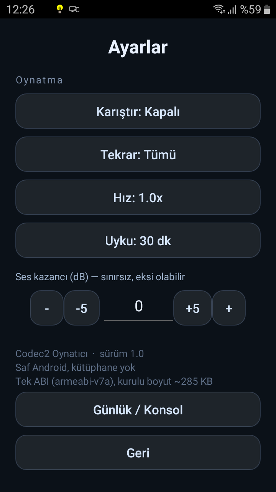

# Codec2 Oynatıcı 🎙️

**Dünyanın en küçük açık ses codec'i [Codec 2](http://www.rowetel.com/codec2.html)'yi çalan ve _üreten_, ~300 KB kurulu boyutlu, saf-native Android uygulaması.**

Harici kütüphane yok (AndroidX yok, Kotlin yok, Material yok) — sadece `android.*` çekirdeği + tek bir küçük JNI `.so`. Tek ABI (`armeabi-v7a`). Kurulu boyut, bir-iki ekran görüntüsü kadar yer kaplamaz.

> A pure-native Android player **and encoder** for [Codec 2](http://www.rowetel.com/codec2.html) voice files. No third-party libraries, single ABI, ~300 KB installed.

<p align="center">
  
  
  
</p>

---

## Codec 2 nedir?

Codec 2 (David Rowe, LGPL), insan sesini **450 – 3200 bit/saniye** arasında sıkıştıran açık bir ses codec'idir. Ne kadar küçük? Bu uygulamada **3 dakikalık bir şarkı, 450 modunda ~14 KB**'a iniyor. Telsiz/uydu/düşük-bant ses iletişimi ve arşivleme için biçilmiş kaftan.

## ✨ Özellikler

**Oynatma**
- Çoklu dosya çalma listesi; dokun-oynat, otomatik sonraki
- Tek ışıyan oynat/duraklat butonu (nabız + ilerleme halkası)
- Dokunup sürüklenerek sarılan **dalga formu**, geçen/toplam süre
- ⏮ ⏭ ileri/geri; uzun-bas ile **±10 sn** sarma; "geri" 3 sn sonra başa sarar
- Karıştır; **3 durumlu tekrar** (kapalı / tümü / tekli)
- **Oynatma hızı** 0.75×–2×
- **Ses kazancı** (dB) — sınırsız, negatif olabilir, serbest değer
- **Uyku zamanlayıcısı** (15/30/60 dk)
- **Kaldığı yerden devam** (parça + konum kalıcı)
- Mod dosya başlığından **otomatik algılanır** (3200…450); modlar renk rozetli

**Arka plan & bildirim**
- Foreground **Service** + MediaSession (kilit ekranı / kulaklık tuşları)
- Bildirimden önceki/oynat-duraklat/sonraki; **ön plana gelince bildirim kalkar**
- Pil: yalnız çalarken wakelock; kulaklık çıkınca otomatik duraklat

**Dosya & dönüştürme**
- SAF ile dosya/çoklu-dosya ekleme; klasörü **özyinelemeli** tarama (izin gerektirmez)
- `.c2` dosyalarını **dışarıdan açma** (tekli ve çoklu intent-filter) → listeye al + çal
- **Herhangi bir sesi `.c2`'ye çevir** (mp3/aac/m4a/opus/ogg/wav/flac…) — cihazın
  kendi codec'leriyle (MediaCodec), **harici kütüphane yok**. Boyut↔kalite modu seçilir,
  dönüştürülen dosya orijinalin yanına yazılır (çakışırsa numaralandırılır)
- **WAV olarak paylaş**: `.c2`'yi normal WAV'a çözüp paylaşır (kendi mini ContentProvider'ı)
- Liste sırasını değiştirme + uzun-bas menüsü (silme yok); **Bilgi** ekranında boyut
- Canlı **Günlük/Konsol** ekranı (dönüştürme adımlarını yazar)

**Tasarım** — animasyonlu gradyan arka plan, ışıyan/nabız atan kontroller, mavi↔mor yumuşak
renk geçişi, çalan satıra renk şeridi, marquee uzun ad, basışta ölçek animasyonu, mod-renkli
etiketler — hepsi kütüphanesiz, saf canvas/animator ile.

## 📦 Neden bu kadar küçük?

| Parça | Boyut |
|---|---|
| `libcodec2player.so` (armeabi-v7a, encode+decode) | ~263 KB |
| `classes.dex` (tüm uygulama) | ~10 KB |
| res + manifest + imza | ~3 KB |
| **Toplam ≈ kurulu boyut** | **~300 KB** |

- **Sadece codec2 ses çekirdeği** derlendi; FreeDV telsiz modemleri (OFDM/COHPSK/FSK/FDMDV)
  ve LDPC tabloları (`H_*.c`, MB'larca) **alınmadı**. Encode kodu, codebook verisinin yanında
  neredeyse bedava (decode-only `.so` 268.544 → encode+decode 268.800 byte).
- **`extractNativeLibs=false`** → `.so` APK'dan mmap edilir, kuruluda kopyalanmaz.
- **`android:debuggable="true"`** → `run-from-apk`; sistem `dex2oat` ile `oat` üretmez,
  kurulu boyut ≈ APK. (Kişisel kullanım için; mağaza dağıtımına önerilmez.)
- Tek ABI, R8 + `shrinkResources`, v1-only EC imza.

## 🔨 Derleme

Standart bir Android projesidir (AGP 8.0.2, compileSdk 33, minSdk 21).

```bash
./gradlew assembleRelease
```

Bu depo, taşınabilir araç zinciriyle (JDK + SDK + Gradle) **çevrimdışı** derleyen
`Derle.ps1` betiğinden türetildi; o betik ayrıca `zipalign -p` + `apksigner` (v1-only, EC)
uygular ve kurulu boyutu minimumda tutan ayarları içerir.

### Native `.so` nasıl üretildi?

`libcodec2player.so`, [Codec 2](https://github.com/drowe67/codec2) 1.0.x kaynağının **yalnız ses
alt kümesi** + `src/main/cpp/Codec2JNI.c` JNI köprüsü ile NDK clang'da (tek ABI, `-O2`,
`--gc-sections`) derlenip strip edilir. Codebook `.c` dosyaları `.txt`'den üretilir
(`native/gen_cb.py`). Adımlar `native/build_jni.ps1` içinde. (Codec 2 kaynağı upstream'den
alınır; bu depo derlenmiş `.so`'yu içerir.)

## 📜 Lisans

- Uygulama kaynağı (bu deponun özgün kodu): **MIT** — `LICENSE`.
- Paketlenen **`libcodec2player.so`**, Codec 2'den türemiştir: **LGPL-2.1**, © David Rowe ve katkıcılar.
  Codec 2: <https://github.com/drowe67/codec2>

## 🙏 Teşekkür

- **David Rowe** ve Codec 2 ekibi — codec'in kendisi.
- `.c2` dosya başlığı (`C0 DE C2 …`) ve JNI yaklaşımı için referans:
  [Codec2Recorder](https://github.com/scuttlebutt-tr/Codec2Recorder) projesi.
